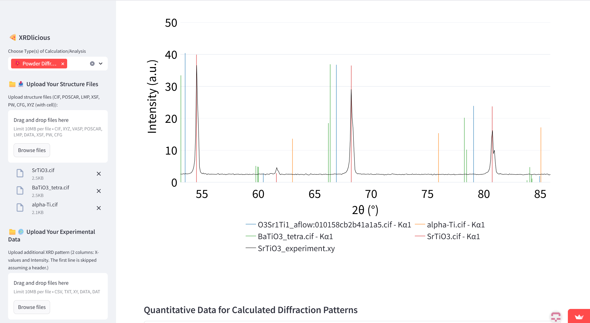

# **XRDlicious: Powder XRD/ND Patterns and PRDF Online Calculator**

An online, web-based tool for calculating powder X-ray and neutron diffraction (XRD and ND) patterns, as well as partial and total radial distribution functions (PRDF, RDF) from crystal structures (CIF, VASP, LMP, XYZ (with cell information)).
It features an integrated search interface for directly accessing and importing structures from the Materials Project (MP), Automatic FLOW (AFLOW), and Crystallography Open Database (COD) databases. Users can also interactively visualize uploaded structures, convert between conventional and primitive cells, and download the corresponding files in different formats (CIF, VASP, LMP, XYZ). 

# **Use the XRDlicious online**
🔗 Try it here: [XRD/ND/PRDF Calculator](https://rdf-xrd-calculator.streamlit.app/)  
🔗 For creation of supercells and point defects, please use the submodule here: [Point defects](https://xrdlicious-point-defects.streamlit.app/)  
🔗 [Tutorial how to use it HERE](https://implant.fs.cvut.cz/xrdlicious/)

For more computationally demanding calculations with more extensive data, please compile the code locally on your computer (follow the manual below).
# **How to compile and run the XRDlicious locally:** 

### **Prerequisities**: 
- Python 3.x (Tested 3.12)
- Console (For Windows, I recommend to use WSL2 (Windows Subsystem for Linux))
- Git (optional for downloading the code)
  

### **Compile the app**  
Open your terminal console and write the following commands (the bold text):  
(Optional) Install Git:  
      **sudo apt update**  
      **sudo apt install git**    
      
1) Download the XRDlicious code from GitHub (or download it manually without Git on the following link by clicking on 'Code' and 'Download ZIP', then extract the ZIP. With Git, it is automatically extracted):  
      **git clone https://github.com/bracerino/xrdlicious.git**

2) Navigate to the downloaded project folder:  
      **cd xrdlicious/**

3) Create a Python virtual environment to prevent possible conflicts between packages:  
      **python3 -m venv xrdlicious_env**

4) Activate the Python virtual environment (before activating, make sure you are inside the xrdlicious folder):  
      **source xrdlicious_env/bin/activate**
   
5) Install all the necessary Python packages:  
      **pip install -r requirements.txt**

6) Run the XRDlicious app (always before running it, make sure to activate its Python virtual environment (Step 4):  
      **streamlit run app.py**

### **Tested versions of Python packages**
Python 3.12.3  

- numpy==1.26.4  
- matplotlib==3.10.3  
- ase==3.25.0  
- matminer==0.9.3  
- pymatgen==2025.5.28  
- plotly==6.1.2  
- streamlit-plotly-events==0.0.6  
- setuptools==80.9.0  
- mp-api==0.45.3  
- aflow==0.0.11  
- pillow==11.2.1  
- pymatgen-analysis-defects==2025.1.18
- psutil==7.0.0  

Currently, the main functions 
